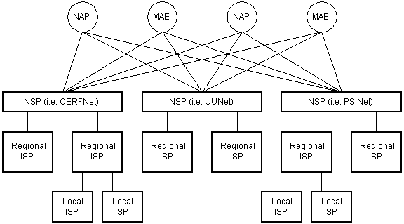

# Dictionary
1. Client: is the device that receives information from the server
2. Web browser: software that display webpages, renders the code that comes from the server
3. Server: is where all the code that makes the webpage is stored, there is the hardware server and software server, an example of software server is APACHE
    + The browser request a webpage to the server and the server serves the webpage files with the code, then the engine of the browser reads and renders the webpage
4. Network: a network is a group of computers connected to each other
5. Internet: group of networks connected to each other. The internet connects all this networks and computers using a set of standarized protocols and routers (the routers routes the packets and tells them at what IP Address have to go)

# IP
Every machine has an IP Address for comunicate with other computers, if the internet is a mailing system then the IP is the address of the computer that indicates where to send or receive the data

ISP (Internet Service Provider) are companies that provide you access to internet, they gave you an IP Address and access to DNS Servers so you can connect to webpages without having to know his IP, to the outside world all the data that comes and goes to your house has only one IP, but if you have multiple devices in your house the ISP will assign a 2nd internal IP to the devices and when the data came out outside the house the data will have another IP

The IP Address esentially is useful for routing

# HTTP
HTTP (Hyper Text Transfer Protocol) is the protocol used to communicate between client and server

# HTTPS (HTTP Secure) 
its the encrypted version of the protocol, the encryption used is SSL/TLS

# FTP
with the FTP (File Transfer Protocol) you can transfer the files of your webpage to the server so you can serve it to other peoplearound the world 

# DNS
The domain name is the address of your webpage (www.google.com for example), this domain is converted by the DNS protocol into an IP Address

The Top Level Domain is the end of the domain (.com for commercial, .net for network, .us for united states, and so on)
You can use whatever TLD you want, the only ones that are hardly regulated are .edu (educational institutions), .mil (US Military) and .gov (goverments)

DNS (Domain Name System) its the protocol used to translate IP Addresses into Domains Name and viceversa, its a hierirchichal and distributed database, the ISP gives you access to the DNS tables

Domain Name: The humthe system is hierarchical, the company that manages the TLD .com is verizon, google.com is a subdomain of .com and drive.google.com is a subdomain of google

# TCP
1. Packets: When sending data through internet the file is divided into small units called packets, later the receiver of this packets unites them and reconstructs the original file, each packet has 64kb of data and in the header there is a checksum value that verifies if a packet is damaged or not
2. Router: Device that tells the packets where to go
TCP or UDP both are responsibles for checking that the packets arrive in a reliable and eficcient way, UDP is the updated version of TCP made by google

+ Port: every app running in a server is assigned with a port number, so the TCP protocol can recognize the app and send the data there
+ Socket: Socket is the combination of IP Address and Port number, is used to exchange information between apps
+ Connection: When two apps want to exchange information a connection is opened, at the beggining the apps negotiate parameters such as windows size, maximum segment size, etc. When the negotiation ends the data is transmitted, the data is divided in segments with metadata that ensured the packets arrive in a reliable way

Every OS has a networking stack, a set of protocols that work together to connect to the internet, this protocols convert plain text into electric signals, send this signals and the receiver convert this signals in plain text

APP Protocol
TCP Protocol (converts the data into small packets of 64kb of data and assigns them a port number so the packet knows to what app has to go to the destination device)
IP Protocol (direct the packets to another device, puts the destiny IP in the header)
Hardware Layer (Converts binary data intro electric signals and electric signals intro binary data, usually the wifi or ethernet card handle this)

this packets goes to the ISP and the ISP has a pool of modems that directs the data to the internet backbone

the internet backbone is made of large networks connected to each other, this giant networks are called Network Service Provider (NSP) (UUNet, CerfNet, IBM, BBN Planet, SprintNet, PSINet), the NSP exchange information beetween them, each NSP is required to connect to three NAP (Network Access Point), NAP is used to connect a NSP with others NSP, the NSP also connect to MAE (Metropolitan Area Exchanges), a MAe does the same as a NAP but the diference is that MAE are privately owned

As for routing the routers only know the IP Addresses of the devices that are below them in the hierarchy, if a router receive a packet with an IP Address that is not below them they send it to a router higher in the hierarchy and so on until the packet found the destiny device

# SSL/TLS
SSL/TLS: Secure Socket Layer/Transport Layer Security, provide secure comunications to the internet

Certificates: Used to establish trust between client and server, they contain information about the identity of the server and are signed by a trusted third party

# DHCP (Dynamic Host Configuration Protocol)
Protocol in charge of assigning IP Addresses, its a table with all non-used IP Addresses and when a new device tries to connect select one of this IP and gives them, when the device finish the connection the IP Address return to the table of available IPs

